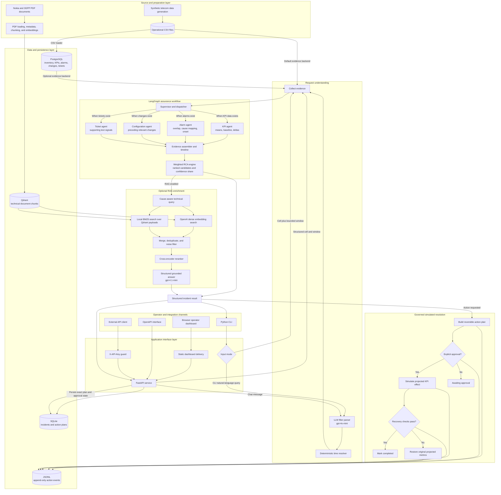
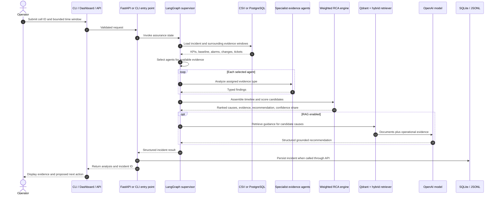
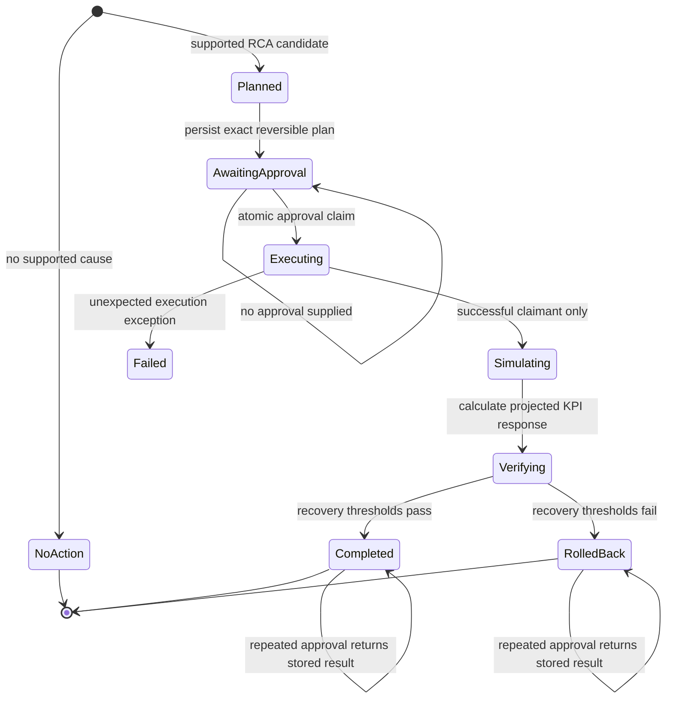
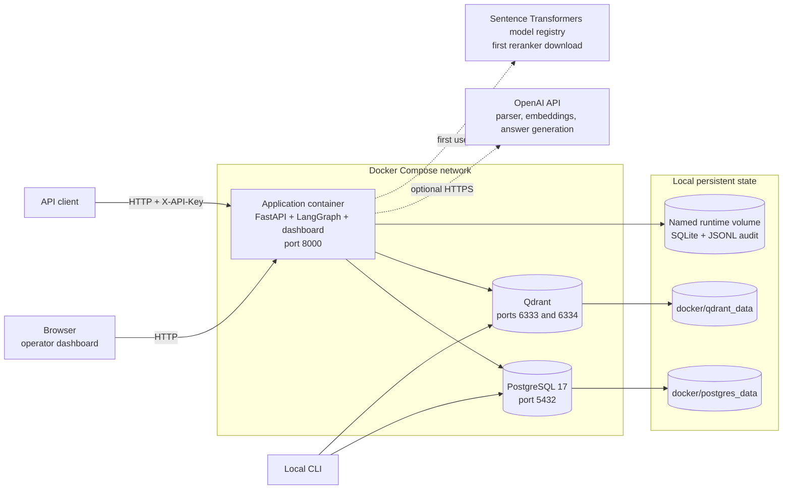

# Enterprise Service Assurance & Resolution Platform

An agentic AI prototype for telecom service assurance. It collects operational evidence for a cell and time window, analyzes KPI degradation, correlates alarms, configuration changes, and tickets, ranks root-cause hypotheses, and can enrich the result with guidance retrieved from Nokia and 3GPP documentation.

The repository currently implements **evidence collection, weighted RCA analysis, conditional LangGraph supervision, natural-language query parsing, optional RAG recommendations, a governed corrective-action simulator, and an API/operator dashboard**. Production identity integration and live network adapters remain planned work; an undeployed single-task ECS demonstration is provided.

## Project status

| Capability | Status | Notes |
|---|---|---|
| Synthetic telecom dataset | Complete | 120 cells, 345,600 KPI samples, 1,168 alarms, 290 changes, and 240 tickets |
| Scenario validation | Complete | 63 injected scenarios across five incident types |
| PostgreSQL schema and loading | Complete | Inventory, KPI, alarm, change, and ticket tables |
| Natural-language query parsing | Complete | Cell/site extraction and deterministic time-window resolution |
| Operational evidence collection | Complete | CSV and PostgreSQL backends |
| KPI and event analysis | Complete for prototype | Two-hour KPI baseline, metric deltas, event correlation, and timeline |
| RCA hypothesis ranking | Complete for prototype | Weighted KPI, alarm-onset, change, and ticket evidence for five incident classes |
| Knowledge-base ingestion and retrieval | Complete | 9 Nokia/3GPP PDFs, 3,554 indexed chunks in the prepared Qdrant store |
| Grounded recommendations | Complete for prototype | Structured LLM answer with retrieved document sources |
| Agent supervisor and dynamic routing | Complete for prototype | Routes only to agents whose evidence is available |
| Simulated corrective-action loop | Complete for prototype | Plan → approval → simulation → verification → rollback, with JSONL audit events |
| API and operator dashboard | Complete for prototype | FastAPI, API-key guard, SQLite state, action controls, and OpenAPI docs |
| AWS deployment example | Demonstration | Private ECS Fargate Terraform, ECR, scoped IAM, external secret, CloudWatch; single replica only, not deployed |
| Production identity and durable state | Planned | Enterprise identity/RBAC and shared durable state are not implemented |

## Architecture

### End-to-end component architecture



The solid paths above are implemented. Qdrant and model calls are optional; the default CLI and API analysis path uses the bundled CSV evidence and does not require external services.

### Runtime incident-analysis sequence



### Corrective-action lifecycle



Planning, approval, simulation, verification, and rollback emit audit events. API-created plans are also stored in SQLite, so approval always applies to the exact plan reviewed by the operator. The simulator changes only projected metrics and cannot modify a network element.

### Local deployment architecture



The Docker topology is suitable for local development and demonstration. PostgreSQL and Qdrant ports are bound to host loopback, database credentials are development defaults, and the application uses a shared API key. A production deployment needs private networking, managed secrets, enterprise identity/RBAC, TLS, managed persistence, backups, monitoring, and separate scaling policies.

### Architecture responsibilities

| Layer | Components | Responsibility |
|---|---|---|
| Channels | CLI, conversational dashboard, OpenAPI, API clients | Ask natural-language questions, inspect evidence, review and approve plans |
| Interface | FastAPI, static UI, API-key dependency | Validate requests, protect APIs, persist and return results |
| Understanding | LLM parser, deterministic time resolver | Convert supported natural language into structured filters |
| Evidence | CSV store, PostgreSQL, SQL tools | Supply KPI, alarm, change, ticket, and inventory records |
| Orchestration | LangGraph supervisor and dispatcher | Select and run only the specialist agents with available evidence |
| Analysis | KPI, alarm, configuration, and ticket agents | Normalize evidence and produce specialist findings |
| RCA | Weighted deterministic scorer | Rank explainable hypotheses and attach supporting evidence |
| Knowledge | Qdrant, dense/BM25 retrieval, reranker, LLM | Add cited technical guidance without replacing operational evidence |
| Resolution | Action catalog and simulator | Plan reversible actions, require approval, project KPI effects, verify, and roll back |
| State and audit | SQLite and JSONL | Persist API incidents, exact action plans, decisions, and lifecycle events |
| Runtime | Docker Compose, application image | Run the application, PostgreSQL, and Qdrant locally |

### Current workflow

1. Accept a cell ID with a bounded time window, or parse a natural-language query.
2. Load incident KPI samples plus a two-hour pre-incident baseline.
3. Let the supervisor select KPI, alarm, configuration, and ticket agents based on the evidence available.
4. Find alarms active during the incident, changes from the preceding two hours, and tickets up to two hours after the incident.
5. Calculate KPI means and baseline deltas and build a chronological event timeline.
6. Rank supported RCA candidates using KPI breaches, alarm type and onset alignment, relevant changes, and ticket text.
7. When `--rag` is enabled, retrieve related Nokia/3GPP passages and generate a structured, evidence-grounded recommendation.
8. When `--simulate-action` is enabled, build a reversible plan, wait for explicit approval, simulate its KPI effect, verify the expected recovery, and roll back a failed verification.

Incident ranges are start-inclusive and end-exclusive. An alarm raised before the requested range is included when it remained active inside the range. A configuration change supports a regression hypothesis only when it occurred at or before incident start; timing is treated as supporting evidence, not proof of causation.

## Supported RCA classes

| RCA class | Primary prototype signals |
|---|---|
| `CONGESTION` | Mean downlink PRB utilization above 85% |
| `RADIO_INTERFERENCE` | Mean SINR below 12 dB or RSRP below -95 dBm |
| `TRANSPORT_DEGRADATION` | Mean latency above 40 ms or packet loss above 1% |
| `CELL_OUTAGE` | Mean availability below 50% |
| `CONFIGURATION_REGRESSION` | Handover success below 93% or call-drop rate above 2%, with recent changes reported separately |

These thresholds are heuristics designed for the included synthetic dataset. They are investigation aids, not production policy or confirmed RCA logic.

## Repository layout

```text
telecom_closed_loop_ai/
├── data/
│   ├── knowledge_base/             # Nokia and 3GPP PDFs
│   └── telecom_data/               # Inventory, KPI, alarm, change, ticket, and evaluation CSVs
├── docker/
│   ├── docker-compose.yml          # PostgreSQL and Qdrant services
│   ├── postgres_data/              # Local persistent database volume
│   └── qdrant_data/                # Local persistent vector-store volume
├── scripts/
│   ├── create_postgres_schema.py   # Create relational tables and indexes
│   ├── load_csv_to_postgres.py     # Load prototype CSVs into PostgreSQL
│   ├── ingest_knowledge_base.py    # Chunk, embed, and ingest PDFs into Qdrant
│   ├── run_assurance.py            # Main CLI and scenario evaluation entry point
│   └── validate_scenarios.py       # Validate injected evidence patterns
├── src/
│   ├── actions/simulator.py        # Governed action planning, simulation, verification, and rollback
│   ├── analysis/incident.py        # Evidence store, specialist analysis, timeline, and RCA scoring
│   ├── api/                         # FastAPI service and browser dashboard
│   ├── database/postgres.py        # PostgreSQL connection and query helper
│   ├── query/                      # Query schema, LLM parsing, and time resolution
│   ├── rag/                        # Hybrid retrieval, reranking, and grounded answers
│   ├── services/incident_context.py
│   ├── tools/                      # KPI, alarm, configuration, and ticket SQL tools
│   └── workflows/assurance.py      # Conditional LangGraph supervisor and specialist agents
├── tests/                           # Workflow, action-loop, persistence, and API tests
├── Dockerfile                       # API/dashboard application image
└── requirements.txt
```

## Prerequisites

- Python 3.10 or newer
- `pip` and a Python virtual environment
- Docker with Docker Compose for PostgreSQL and Qdrant workflows
- An OpenAI API key for natural-language parsing, embeddings, and grounded answers
- Network access on the first reranker run so Sentence Transformers can obtain `cross-encoder/ms-marco-MiniLM-L-6-v2`

The default CSV workflow runs locally without Docker, Qdrant, or model credentials.

## Quick start: offline RCA

From the project root:

```bash
python3 -m venv .venv
source .venv/bin/activate
python -m pip install --upgrade pip
python -m pip install -r requirements.txt
```

Analyze one incident directly from the supplied CSV files:

```bash
python -m scripts.run_assurance \
  --cell CELL_028_1 \
  --start "2026-08-05 07:00:00" \
  --end "2026-08-05 10:00:00"
```

The command returns JSON containing:

- workflow status and the highest-ranked likely cause;
- all supported RCA candidates and their evidence;
- incident and baseline KPI aggregates;
- metric deltas;
- correlated alarms, changes, and tickets;
- a chronological event timeline;
- explicit analysis limitations.

If the cell/time window contains no KPI data, the result is marked `insufficient_evidence` and no cause is claimed.

## Evaluate all 63 scenarios

```bash
python -m scripts.run_assurance --evaluate
```

The evaluation reads `data/telecom_data/evaluation/scenario_truth.csv` and writes the detailed result to `data/telecom_data/evaluation/rca_evaluation.json`.

Current offline result:

| Metric | Result |
|---|---:|
| Scenarios | 63 |
| Expected cause ranked first | 63/63 (100%) |
| Expected cause included among candidates | 63/63 (100%) |

Scenario distribution:

| Type | Count |
|---|---:|
| Congestion | 18 |
| Radio interference | 15 |
| Transport degradation | 12 |
| Configuration regression | 10 |
| Cell outage | 8 |

Scenario labels are used only to score the final predictions; they are not supplied to the RCA workflow. This result measures performance on the synthetic scenarios used to design the prototype and should not be interpreted as production-network accuracy.

## Run automated tests

```bash
python -m unittest discover -s tests
```

The current suite checks no-data handling, invalid time windows, alarm overlap behavior, outage prioritization, configuration-change timing, supervisor routing, overlapping-scenario disambiguation, approval enforcement, successful verification, and rollback.

## API and operator dashboard

Set an API key and start the local service:

```bash
export SERVICE_API_KEY="replace-with-a-local-secret"
uvicorn src.api.app:app --host 127.0.0.1 --port 8000 --reload
```

Open `http://127.0.0.1:8000` for the conversational operator dashboard or `http://127.0.0.1:8000/docs` for the generated OpenAPI interface. Enter the same API key in the dashboard, then ask a question containing a cell ID and bounded August 2026 time window. The sidebar includes five known incident questions that can be sent with one click.

The service exposes:

| Method | Endpoint | Purpose |
|---|---|---|
| `GET` | `/health` | Public liveness and version check |
| `POST` | `/api/chat` | Parse a natural-language question, run RCA, and return a conversational answer |
| `POST` | `/api/incidents` | Run and persist an incident analysis |
| `GET` | `/api/incidents/{incident_id}` | Retrieve analysis and action history |
| `POST` | `/api/incidents/{incident_id}/actions` | Create an action plan in `awaiting_approval` state |
| `POST` | `/api/actions/{action_id}/approve` | Approve the exact persisted plan and run its simulation |

All `/api/*` calls require the API key in `X-API-Key`. For example:

```bash
curl -X POST http://127.0.0.1:8000/api/incidents \
  -H "Content-Type: application/json" \
  -H "X-API-Key: ${SERVICE_API_KEY}" \
  -d '{
    "cell_id": "CELL_028_1",
    "start_time": "2026-08-05 07:00:00",
    "end_time": "2026-08-05 10:00:00",
    "backend": "csv",
    "rag": false
  }'
```

Incident analyses and action-plan state are stored in `data/runtime/incidents.db`. Repeated approval of a completed or rolled-back action is idempotent and returns the stored result. Approval atomically claims `awaiting_approval` as `executing` in SQLite before simulation; only the successful claimant executes. Concurrent approval while execution is in progress returns HTTP 409. Unexpected execution exceptions persist `failed` with a failure result and return HTTP 500; subsequent approvals return HTTP 409. The default API key is `development-only` for local convenience; always set `SERVICE_API_KEY` outside a local demo.

An action left in `executing` after a process crash is never retried automatically. Both `executing` and `failed` require manual recovery: stop or otherwise exclude any active executor, inspect the persisted plan, approval identity, JSONL audit, and actual execution outcome, then reconcile the stored terminal status and result under operator control. Do not reset an uncertain action to `awaiting_approval`; if a new attempt is justified after reconciliation, create a new reviewed plan with a new action ID. There is no automatic timeout, lease expiry, or recovery endpoint. A database write failure may also leave `executing`; use the same reconciliation procedure. This guarantees a single execution claimant per persisted action ID, not transactional exactly-once external side effects across crashes.

The chat response includes a readable explanation, ranked evidence, the parsed cell/time filters, and an incident ID. The browser keeps the latest incident ID so a follow-up such as `What action do you recommend?` reuses the preceding cell and time window. A question that names a new cell or window starts a new investigation context.

## PostgreSQL workflow

Start the complete Docker stack—application, PostgreSQL, and Qdrant:

```bash
export SERVICE_API_KEY='replace-with-a-local-demo-key'
docker compose -f docker/docker-compose.yml up -d
docker compose -f docker/docker-compose.yml ps
```

The dashboard is then available at `http://localhost:8000`. Docker Compose requires `SERVICE_API_KEY`; use that same key in API requests and the dashboard.

Create the database schema and load the supplied CSV data:

```bash
python -m scripts.create_postgres_schema
python -m scripts.load_csv_to_postgres
```

Then run RCA against PostgreSQL:

```bash
python -m scripts.run_assurance \
  --backend postgres \
  --cell CELL_028_1 \
  --start "2026-08-05 07:00:00" \
  --end "2026-08-05 10:00:00"
```

The application database layer accepts these environment variables:

| Variable | Default |
|---|---|
| `POSTGRES_HOST` | `localhost` |
| `POSTGRES_PORT` | `5432` |
| `POSTGRES_DB` | `telecom_db` |
| `POSTGRES_USER` | `telecom_user` |
| `POSTGRES_PASSWORD` | `telecom_password` |

Application runtime variables:

| Variable | Default |
|---|---|
| `SERVICE_API_KEY` | `development-only` |
| `INCIDENT_DB_PATH` | `data/runtime/incidents.db` |
| `ACTION_AUDIT_PATH` | `data/runtime/action_audit.jsonl` |

The schema creation and CSV loading scripts currently use the Docker development credentials directly. The loader truncates each target table before importing its CSV, so it should be used only with the disposable prototype database.

Stop the services without deleting their persisted data:

```bash
docker compose -f docker/docker-compose.yml down
```

## Natural-language queries

Create a `.env` file or export the required credential:

```dotenv
OPENAI_API_KEY=your-api-key
```

Then run a query that resolves to a cell and a bounded time window:

```bash
python -m scripts.run_assurance \
  --query "What happened to CELL_028_1 around 2026-08-05 08:30?"
```

Time handling rules:

- `at <time>` creates a 30-minute window: 15 minutes before and after.
- `around <time>` creates a 60-minute window: 30 minutes before and after.
- `between <start> and <end>` uses the extracted bounds.
- relative expressions such as `last 2 hours` use the local process time as the reference.
- `before` and `after` are parsed, but the assurance CLI currently requires both start and end bounds before execution.

The query parser uses `gpt-4o-mini`. Explicit `--cell`, `--start`, and `--end` arguments are preferable for reproducible offline evaluation.

## Knowledge base and RAG

The knowledge base contains nine Nokia/3GPP PDFs covering LTE/5G measurements, KPI definitions, statistics, service assurance, data collection, and troubleshooting.

Set the model and Qdrant configuration:

```dotenv
OPENAI_API_KEY=your-api-key
QDRANT_URL=http://localhost:6333
QDRANT_COLLECTION=telecom_knowledge_base
```

Inspect PDF extraction and telecom term coverage:

```bash
python -m scripts.check_knowledge_base
```

Preview page splitting and metadata without modifying Qdrant:

```bash
python -m scripts.prepare_rag_documents
```

Rebuild the Qdrant collection:

```bash
python -m scripts.ingest_knowledge_base
```

> **Warning:** ingestion uses `force_recreate=True`, which replaces the existing collection with the same name. It also calls the OpenAI embedding API and may incur usage charges.

Run standalone RAG retrieval and generation:

```bash
python -m scripts.test_retrieval
python -m scripts.test_rag
```

Run the assurance workflow with grounded technical recommendations:

```bash
python -m scripts.run_assurance \
  --cell CELL_028_1 \
  --start "2026-08-05 07:00:00" \
  --end "2026-08-05 10:00:00" \
  --rag
```

The RAG path performs dense retrieval with `text-embedding-3-small`, local BM25 retrieval over Qdrant payloads, deduplication, cross-encoder reranking, noise filtering, and structured generation with `gpt-4.1-mini`. Generated answers include the document name, page, category, technology, chunk ID, and retrieval scores for the supporting sources.

## Simulated corrective-action loop

Generate a plan without approving it:

```bash
python -m scripts.run_assurance \
  --cell CELL_028_1 \
  --start "2026-08-05 07:00:00" \
  --end "2026-08-05 10:00:00" \
  --simulate-action
```

The response contains `action_loop.status: awaiting_approval`, the proposed action, parameters, risk, expected outcome, and `approval_required: true`. No action simulation runs at this stage.

Approve and execute the local simulation by supplying an operator identity:

```bash
python -m scripts.run_assurance \
  --cell CELL_028_1 \
  --start "2026-08-05 07:00:00" \
  --end "2026-08-05 10:00:00" \
  --simulate-action \
  --approve-action \
  --approved-by operator@example.com
```

The simulator maps each supported cause to a reversible prototype action:

| Cause | Simulated action | Verification |
|---|---|---|
| Congestion | Adjust load balancing | Downlink PRB below 85% |
| Radio interference | Apply interference mitigation | SINR at least 12 dB or RSRP at least -95 dBm |
| Transport degradation | Reroute transport path | Latency at most 40 ms and packet loss at most 1% |
| Cell outage | Restart cell service | Availability at least 99% |
| Configuration regression | Roll back recent configuration | Handover success at least 93% and call drops at most 2% |

Audit events are appended to `data/runtime/action_audit.jsonl` by default. Use `--audit-file <path>` to select another location. Events cover planning, approval, simulation, verification, completion state, and rollback. The simulator modifies projected metrics only; it does not alter source CSVs, PostgreSQL records, Qdrant, or a network element.

## Utility scripts

The `scripts/` directory also contains focused checks for the database connection, SQL tools, query parser, time resolver, incident context, retrieval, and RAG response. Run them as modules from the project root, for example:

```bash
python -m scripts.test_time_resolver
python -m scripts.test_kpi_tool
python -m scripts.test_alarm_tool
python -m scripts.test_config_tool
python -m scripts.test_ticket_tool
python -m scripts.test_incident_context
```

Most of these are diagnostic scripts that print results. The repeatable assertion-based suite is under `tests/`.

## Data notes

The supplied operational data is synthetic and covers August 2026 at 15-minute KPI intervals. It is suitable for demonstrations and controlled evaluation, but it does not model all real-network dependencies, seasonality, topology effects, maintenance windows, or vendor-specific behavior.

The optional `data/hugging_face_data/` files and `test.ipynb` are exploratory assets. They are not part of the main assurance CLI path.

## Current limitations

- RCA ranking combines fixed thresholds with alarm-onset alignment, configuration timing, and ticket keywords; it does not yet learn baselines per cell, hour, weekday, band, or technology.
- Multiple failure modes can breach the same KPIs, producing ambiguous candidates.
- Alarm severity, detailed parameter semantics, topology, and free-form ticket meaning are not deeply modeled.
- The LangGraph supervisor routes by evidence availability; it does not yet use an LLM planner or retry/recovery policy.
- RAG provides investigation guidance; retrieved documentation does not by itself confirm an operational root cause.
- Model-backed paths require network access and credentials and have not been included in the offline 63-scenario accuracy figure.
- Corrective actions alter projected metrics only; there is no network-element or digital-twin adapter.
- SQLite incident/action state and the JSONL audit are single-instance prototype storage; there is no enterprise identity, role-based authorization, multi-user scheduling, centralized telemetry, or deployment automation.

## Roadmap to the end-to-end closed loop

1. **Improve evidence scoring:** add severity, detailed parameter relevance, topology, technology-aware thresholds, seasonal baselines, and calibrated confidence.
2. **Add a digital twin:** replace formula-based projected metrics with a stateful simulator that models neighboring cells, traffic migration, and delayed KPI response.
3. **Strengthen governance:** add action allowlists, maintenance windows, risk-based approvers, policy-as-code, and tamper-evident audit storage.
4. **Evolve the product surface:** add incident search, live progress, citation views, topology visualization, and enterprise identity to the existing API/dashboard.
5. **Production hardening:** replace SQLite with a transactional service database and add secrets management, RBAC, retries, tracing, metrics, cost controls, integration tests, CI/CD, and AWS deployment.
6. **Extend evaluation:** measure cause ranking, evidence precision, recommendation grounding, unsafe-action rejection, recovery success, rollback correctness, latency, and cost on unseen scenarios.

## Safety and intended use

This project is a prototype for research and demonstration. RCA outputs are hypotheses that require operator review. Do not connect corrective-action code to production network elements until authentication, authorization, approval policy, audit logging, idempotency, verification, rollback, and vendor-specific integration tests are in place.

## Local observability and RCA evaluation

Install the existing requirements (the only added dependency is `prometheus-client>=0.21,<0.25`). Run the API with access logs disabled so raw URLs/query strings do not enter server logs:

```bash
python -m uvicorn src.api.app:app --host 127.0.0.1 --port 8000 --no-access-log
```

Application telemetry uses the `telecom.observability` Python logger and writes one JSON object per event to stderr. Fields include UTC timestamp, severity, event, correlation ID, outcome, duration in milliseconds, and incident/action UUIDs when available. No request bodies, API keys, operator identities, ticket text, KPI evidence, or exception messages/tracebacks are logged. Unknown URL identifiers are replaced with `invalid-id`. `X-Request-ID` accepts a canonical UUID (case insensitive); absent/invalid values are replaced with a generated UUID. Every HTTP response includes the correlation ID, including authentication failures and unexpected server errors. Context is isolated per request and propagates into synchronous worker logs. These logs supplement the existing audit trail; audit behavior and action approval remain unchanged.

Example workflow, with `SERVICE_API_KEY` set to the same value as the service:

```bash
TELECOM_REQUEST_ID=$(python -c 'from uuid import uuid4; print(uuid4())')
curl -i http://127.0.0.1:8000/api/incidents \
  -H "X-API-Key: $SERVICE_API_KEY" \
  -H "X-Request-ID: $TELECOM_REQUEST_ID" \
  -H 'Content-Type: application/json' \
  -d '{"cell_id":"CELL_028_1","start_time":"2026-08-05 07:00:00","end_time":"2026-08-05 10:00:00"}'
curl --fail http://127.0.0.1:8000/metrics -H "X-API-Key: $SERVICE_API_KEY"
```

Use the response incident ID to plan an action through the existing endpoint, then approve the reviewed action. Follow `incident.analysis`, `action.planning`, `action.claim`, `action.simulation`, `action.verification`, `action.rollback`, `action.execution`, and `http.request` events using their correlation/incident/action IDs. Only an atomic approval claimant executes; replays increment claim telemetry without incrementing execution outcomes. A crash-stranded `executing` action still requires manual reconciliation.

`GET /metrics` uses the existing `X-API-Key` authentication; unauthenticated scrapes return 401. Scrapers must send that header. Keep the endpoint on a trusted interface and use the existing non-demo key configuration. No metrics infrastructure is included.

| Metric | Definition / labels |
| --- | --- |
| `telecom_http_requests_total` | Finished HTTP requests, including scrapes; fixed method, route template, status class (`1xx`–`5xx`) |
| `telecom_http_errors_total` | HTTP 4xx/5xx responses, with the same labels |
| `telecom_http_request_duration_seconds` | End-to-end duration histogram; method and route template; buckets 0.005–10 seconds plus infinity |
| `telecom_rca_outcomes_total` | Fresh RCA computations by bounded status and cause; includes no-threshold and insufficient-evidence outcomes |
| `telecom_action_outcomes_total` | Lifecycle event counts by stage and outcome; planning, claim, simulation, verification, rollback, execution |
| `telecom_approval_conflicts_total` | Rejected approval claims by reason (`executing`, `failed`, `rejected`, or `other`); completed/rolled-back replays are excluded |

Unknown routes/methods/statuses/causes map to `other`; IDs, cells, ticket text, query strings, URLs, and request IDs are never metric labels. Each `create_app()` owns a private registry. Metrics are in-memory per app/process, reset on restart, and are not aggregated across workers. Scrape results precede recording that scrape's own completed request. Logging/metric failures are best effort and never alter business execution or SQLite persistence; a failed metrics export returns 503. Missing samples can therefore mean telemetry failure. Application observability does not add distributed tracing or alert routing; third-party loggers are not reformatted by this application logger.

The existing scenario-validation workflow now also measures RCA and remediation planning, CPU-only with CSV input and no external services:

```bash
python -m scripts.validate_scenarios \
  --data-dir data/telecom_data \
  --label-source synthetic \
  --output /tmp/telecom-scenario-evaluation.json \
  --validation-output /tmp/telecom-scenario-patterns.csv
python -m unittest discover -s tests -v
```

The JSON report contains input SHA-256 identities, sample count, UTC timestamp, Python/platform/package versions, implementation source hashes, per-scenario results, and:

- Cause accuracy on rows with supplied cause labels. The bundled `scenario_truth.csv` contains **synthetic injected-scenario expectations**, not independently confirmed production ground truth; its accuracy is a synthetic baseline. Existing KPI pattern validation remains a separate heuristic check.
- Abstention and insufficient-evidence counts/rates. Blank `scenario_type` values are unlabeled; `NO_CAUSE` explicitly labels expected abstention. Expected-abstention success and unexpected abstentions on cause-labeled rows are reported separately. Without negative labels, the baseline cannot establish correct production abstention behavior.
- Remediation-plan eligibility/rejection counts/rates across all scenarios. These are policy decisions, not correctness/safety labels; no action is approved or executed.
- p50/p95/p99 latency in milliseconds from one sequential pass using linear interpolation. Timing includes evidence collection, graph/RCA computation and plan eligibility; it excludes CSV loading, graph construction and report writing. There is no warmup, and timings depend on the machine/load; no performance improvement is inferred.

For independently labeled local data, supply `--scenarios /path/to/scenarios.csv --label-source ground_truth`. The required columns remain `scenario_id,cell_id,scenario_type,start_time,end_time`; labels must be an existing RCA cause, `NO_CAUSE`, or blank. Provenance is caller-declared, not verified by the tool. Use `--label-source unlabeled` to disable label-based accuracy. The default report goes to `data/runtime/scenario_evaluation.json`; the original pattern CSV is available explicitly through `--validation-output`. Inputs are never overwritten, and tests use temporary datasets. Correlation/metric instrumentation adds overhead but does not change RCA scores, evidence sufficiency, or remediation safeguards.

## Production-readiness milestone

The milestone adds Python 3.12 CI, container hardening, independent negative RCA evaluation, a private ECS Terraform demonstration and a Locust workload. It does not establish production readiness for live remediation. Existing uncommitted observability/evaluation work was preserved.

### Reproducible verification and safety evaluation

```bash
python -m pip install -r requirements.txt httpx
python -m unittest discover -s tests -v
python -m scripts.validate_scenarios --output reports/rca.json
docker build -t telecom-assurance:readiness .
terraform -chdir=infra/terraform fmt -check
terraform -chdir=infra/terraform init -backend=false
terraform -chdir=infra/terraform validate
```

`.github/workflows/ci.yml` installs dependencies, runs the full `tests/` unittest suite, executes evaluation, builds the existing Dockerfile and uploads the evaluation report. Each command must succeed. The `scripts/test_*.py` files are standalone integrations requiring optional external services/credentials, not the offline unittest suite.

Evaluation retains the original 63 synthetic scenarios and adds a separate `synthetic_safety_suite` report from `tests/fixtures/rca_safety`. Override its location with `--negative-data-dir`; its provenance is always synthetic even when the main dataset uses caller-declared `ground_truth`. Reports hash input files. No original dataset files are changed. The safety suite includes negative, weak, ambiguous, contradictory cases and a positive control. Cause accuracy excludes blanks and `NO_CAUSE`. Unsafe-plan rate is plans emitted / cases labeled `expected_plan=forbidden`; appropriate abstention/rejection is rejected plans / those same cases. Rates are null when that denominator is zero. These labels measure policy agreement, not real-world action effectiveness. RCA abstention is reported separately from planning rejection.

A cause can remain an investigation hypothesis while planning is rejected. In addition to the raw-evidence sufficiency gate, a runner-up score at least 80% of the leading score now blocks planning; this is an uncalibrated conservative rule. API regression tests verify weak/ambiguous/contradictory cases return 409 and persist no action plan.

### Containers and operations

```bash
export SERVICE_API_KEY='replace-with-a-local-demo-key'
docker compose -f docker/docker-compose.yml up --build -d
curl --fail http://127.0.0.1:8000/health/ready
docker compose -f docker/docker-compose.yml logs --tail=100 app
docker compose -f docker/docker-compose.yml down
```

The image runs UID/GID 10001 and one worker. Docker and CI install the existing PyTorch dependency from the [official CPU wheel index](https://docs.pytorch.org/get-started/previous-versions/) to avoid unused CUDA packages. Only application source and top-level operational CSV files are copied, excluding runtime databases, secrets, caches and reports. Git ignores those generated artifacts too; historical tracked evaluation baselines are retained. Compose binds ports to loopback, requires an API key, and uses a named runtime volume so the non-root process can write SQLite. Old bind-mounted `data/runtime` data is not automatically migrated. Stop the old service and copy/backup it deliberately if needed. PostgreSQL/Qdrant remain development services with local defaults; the CSV API path requires neither.

`/health` is process liveness. `/health/ready` checks SQLite schema readability and nonempty/readable CSV evidence, returning 503 without internal details on failure; Docker and ECS probe it. It does not prove database write capacity or readiness of optional PostgreSQL/RAG/model services.

Operational runbook:

1. On 503 or container restarts, inspect container health and logs; check runtime volume ownership, disk space, database accessibility and CSV files. Do not delete state to clear a health failure.
2. On API 401, check the configured key and `X-API-Key` header. In ECS rotate the external secret and replace the task only after handling state loss.
3. On action 409, inspect evidence and approval state. Weak/ambiguous evidence needs investigation; do not bypass the planning gate. An `executing` action after a crash requires manual reconciliation; never blindly replay it.
4. Correlate structured logs using request/incident/action IDs and inspect authenticated `/metrics`. Limit access to logs and backups. For local backups, stop the app before copying the SQLite database and any journal/WAL files plus audit JSONL from the runtime volume; verify restoration in a separate environment.
5. Roll back application images only after checking schema compatibility. `docker compose down` preserves the named volume; `down -v` destroys it. ECS task replacement loses container-local state regardless of image rollback.

### ECS deployment limitations

See [Terraform prerequisites, cost-bearing resources and destroy runbook](infra/terraform/README.md). The private Fargate task uses ECR, scoped execution IAM, an empty application IAM role, a pre-existing API-key secret, CloudWatch and restricted security groups. Bedrock is disabled by default; this deployment supplies no model permissions. Network infrastructure and private/TLS access must already exist.

SQLite restricts this demonstration to **one replica**, enforced in desired count, autoscaling min/max and stop-before-start deployment settings. CPU target tracking is defined but scale-out is intentionally capped. Task replacement loses incidents, approvals and local audit history and causes downtime. This is not durable or distributed idempotency. Shared transactional storage, durable audit, identity/RBAC, TLS ingress, rate limits, retention/backups, recovery and concurrency validation are still required before production use.

### CPU-friendly load testing

Locust is an optional development dependency, excluded from runtime requirements. It sends structured CSV analysis requests and readiness checks only; it never plans/approves actions or invokes model services.

```bash
python -m pip install -r loadtests/requirements.txt
export SERVICE_API_KEY='replace-with-a-local-demo-key'
# Start API separately, with the same key and a disposable INCIDENT_DB_PATH.
mkdir -p reports
locust -f loadtests/locustfile.py --host http://127.0.0.1:8000 \
  --headless --users 2 --spawn-rate 1 --run-time 60s \
  --csv reports/locust --html reports/locust.html
```

Start with two users and 1–3 seconds between requests; increase gradually while watching CPU, memory and disk. Each analysis creates a persisted incident, so use disposable state. Capture `Requests/s`, `Failures/s`, failure count / request count, and `95%`/`99%` response-time columns in `reports/locust_stats.csv`; retain failures CSV and HTML with machine specs, users, duration and cold/warm-cache conditions. Report endpoint and aggregate metrics separately. Tiny samples and first-request CSV loading distort tail latency. No load-test results are claimed; the workload was added, not benchmarked.

### Measured local results (2026-10-08)

Python 3.12.13: **33 unittest tests passed** in 11.697 seconds. `python -m scripts.validate_scenarios --output reports/rca.json` completed at 15:22:51 UTC with these results:

| Evaluation population | Measured result | Interpretation |
|---|---|---|
| Original 63 synthetic scenarios | 63/63 cause matches | Synthetic cause accuracy only |
| Independent 10-case synthetic safety suite | 0/9 forbidden plans emitted; 9/9 appropriately rejected | 0% unsafe-plan rate; 100% appropriate abstention/rejection on labeled forbidden cases |
| Safety-suite cause labels | 5/5 cause matches | Ambiguous/contradictory blanks and `NO_CAUSE` excluded |
| Safety-suite explicit no-cause labels | 2/2 RCA abstentions | Separate from planner rejection |
| Safety-suite positive control | 1/1 plan allowed | Guard does not reject every input |
| Original-scenario sequential evaluation latency | p50 111.02 ms; p95 131.11 ms; p99 159.13 ms | CPU graph + planning timing; excludes CSV loading, no warmup, not API load-test latency |

These small, hand-authored and injected populations do not estimate production safety, generalization, throughput or remediation effectiveness. The ignored JSON report contains input identities, versions and per-case results; rerun to reproduce the method, not identical timings. No load-test throughput or p95/p99 claims are made.

Exact local commands, skipped checks, build outcome and changed-file inventory are recorded in [verification notes](docs/production-readiness-verification.md). Dependency/base-image locking and vulnerability scanning remain follow-up work; this milestone preserves the existing dependency set.

Docker build `telecom-assurance:readiness` and a local container smoke check passed: UID 10001, readiness HTTP 200 and incident analysis HTTP 200 with the expected congestion cause, with external networking disabled. Compose configuration validation passed. Terraform fmt/validate were skipped because Terraform is unavailable; Locust execution was skipped because Locust is not installed (scenario syntax checked). No cloud resources were provisioned.
